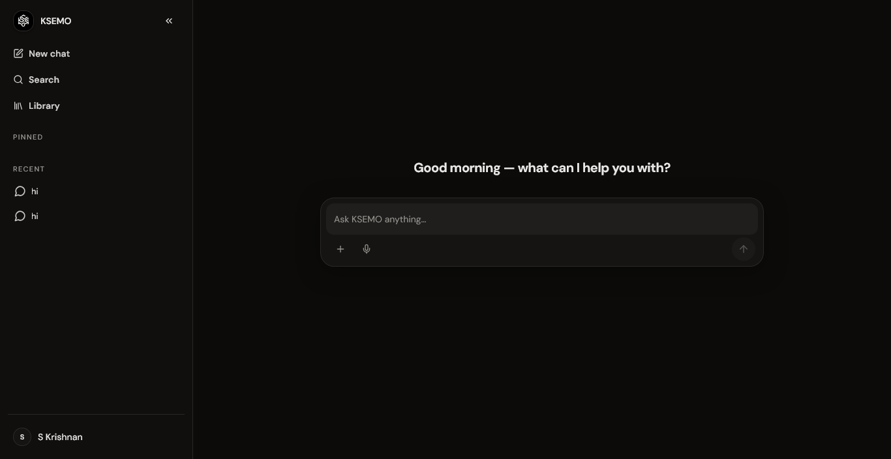

<p align="center">
  
</p>

<h1 align="center">KSEMO</h1>

<p align="center">
  Your private space to think, talk, and remember. An AI-powered conversational platform with voice interaction, file intelligence, and full conversation management.
</p>

<p align="center">
  <a href="#overview">Overview</a> &nbsp;&middot;&nbsp;
  <a href="#key-features">Features</a> &nbsp;&middot;&nbsp;
  <a href="#how-it-works">How It Works</a> &nbsp;&middot;&nbsp;
  <a href="#installation">Installation</a> &nbsp;&middot;&nbsp;
  <a href="#usage">Usage</a> &nbsp;&middot;&nbsp;
  <a href="#license">License</a>
</p>

<br/>

## Overview

KSEMO is a full-stack AI chat platform built to give you a single, private place to have intelligent conversations, manage files, capture ideas, and interact with AI using both text and voice. Instead of juggling multiple chat apps, note-taking tools, and file managers, KSEMO brings everything together in one beautifully designed application.

The platform connects to Google Gemini as its primary AI backend with automatic fallback to secondary providers, ensuring your conversations never hit a dead end. Every response streams in real time, every voice command is transcribed instantly, and every file you upload becomes part of the AI's context.

Whether you are brainstorming ideas, analyzing documents, drafting content, or simply having a conversation with an advanced AI, KSEMO gives you the tools to think freely and work efficiently — all from a single, unified interface.

<br/>

## Project Overview

KSEMO is designed around one core idea: talking to AI should feel as natural as talking to a person, and everything you need should be in one place.

The experience begins on the authentication page, where you can sign in with Google or use email and password. Once inside, you land on a clean, focused chat interface with a collapsible sidebar for navigating all your conversations. Every chat is searchable, sortable, and organized.

From the main interface, you can start a new conversation instantly, attach files for the AI to analyze, or switch to voice mode for hands-free interaction. The AI responds with streaming text, supports markdown and syntax-highlighted code, and lets you edit, regenerate, or version-track any message.

Beyond simple chat, KSEMO includes a personal file library for managing uploaded documents, a project system for grouping related conversations, export capabilities for saving chats as PDF or Word documents, and public sharing for when you want to share a conversation with others. User preferences let you tune the AI's personality, choose between multiple Gemini models, and customize the interface to match your workflow.

<br/>

## Key Features

**AI Conversations**

Chat with an AI assistant powered by Google Gemini with real-time streaming responses via Server-Sent Events. The system supports multiple Gemini models with automatic fallback when quota is exhausted, equal-jitter exponential backoff on transient failures, and a secondary AIML API provider for maximum reliability. Choose between balanced, concise, creative, or analytical personas, or write your own custom system instructions.

**Voice Mode**

Speak naturally and hear responses aloud. KSEMO uses the browser's MediaRecorder API for voice capture and Gemini's multimodal capabilities for transcription. AI responses can be read back using the Web Speech Synthesis API with configurable speech rate. Continuous recording with live duration display keeps the experience seamless.

**File Library and Intelligence**

Upload files up to 25 MB — PDFs, Word documents, Excel spreadsheets, PowerPoint presentations, images, and more. KSEMO extracts text content from documents using libraries like unpdf, mammoth, and xlsx, then injects that content as context into your AI conversations. Images are sent inline as base64 for visual analysis. Mark files as favorites for quick access.

**Screenshot Capture**

Capture your screen directly from the browser using the getDisplayMedia API. Screenshots are automatically uploaded to your library and can be attached to conversations for the AI to analyze — perfect for sharing error messages, designs, or visual references.

**Conversation Management**

Full control over every conversation: create, rename, duplicate, archive, pin, trash, and permanently delete. Soft-delete sends conversations to a trash folder where they can be restored. Full-text search powered by PostgreSQL GIN indexes lets you find any message across all conversations instantly.

**Message Versioning**

Edit any user message and the AI automatically regenerates its response. Every edit is tracked in a version history, and you can restore any previous version of a message with one click. Regenerate assistant responses independently to explore different answers.

**Conversation Export and Sharing**

Export any conversation as a formatted PDF or Word document. Share conversations publicly via unique tokens — anyone with the link can view the full conversation on a dedicated public page without needing an account.

**Project Organization**

Group related conversations into named projects with project-specific AI instructions. Archive projects you are done with to keep your workspace clean.

**Authentication and Security**

Sign in with Google OAuth 2.0 with CSRF protection, or use email and password with scrypt hashing. JWT sessions work across browsers with a Bearer token fallback for Safari ITP and private browsing. Password reset flows are handled via styled HTML emails.

**User Settings and Personalization**

Choose your AI model, persona, and custom instructions. Control speech rate, auto-play behavior, and motion accessibility. Toggle between dark and light themes with persistent preferences.

<br/>

## How It Works

**1. Sign In and Get Started**

Open the application and sign in with Google or your email and password. You will land on the main chat interface with a welcome screen ready for your first conversation.

**2. Start a Conversation**

Type a message in the composer at the bottom of the screen. The AI responds in real time with streaming text. Attach a file to provide document context.

**3. Use Voice Mode**

Click the microphone button to start voice recording. Speak your message and KSEMO transcribes it automatically using Gemini's multimodal AI. The AI's response can be read aloud using text-to-speech. Toggle continuous recording for ongoing voice interaction.

**4. Manage Your Files**

Open the workspace panel to access your file library. Upload documents, images, and spreadsheets. Attach any file to a conversation to give the AI context from your documents. Favorite important files for quick access later.

**5. Organize with Projects**

Create projects to group related conversations. Add project-specific instructions so the AI behaves consistently within each project. Archive completed projects to keep your workspace tidy.

**6. Edit, Regenerate, and Version**

Click on any message to edit it. The AI regenerates its response based on your updated input. Open the version history to see all previous edits and restore any version. Use the regenerate button to get a different AI response without changing your message.

**7. Export and Share**

Export a conversation as a PDF or Word document for offline reading. Generate a public share link to let anyone view the conversation without an account.

**8. Customize Your Experience**

Open settings to choose your AI model, persona, and custom system instructions. Adjust speech rate, toggle auto-play, enable reduced motion, and switch between dark and light themes.

<br/>

## Installation

**Prerequisites**

- Node.js 18 or higher
- pnpm package manager
- A Supabase project (free tier available at supabase.com)
- API key for Google Gemini
- Google OAuth credentials (optional, for Google Sign-In)
- SMTP credentials (optional, for password reset emails)

**Setup**

```bash
git clone <repository-url>
cd KSEMO

pnpm install
```

**Environment Configuration**

Create a `.env` file in the project root:

```
SUPABASE_URL=your_supabase_url
SUPABASE_ANON_KEY=your_supabase_anon_key
SUPABASE_SERVICE_ROLE_KEY=your_supabase_service_role_key
JWT_SECRET=your_jwt_secret
GEMINI_API_KEY=your_gemini_api_key
AIML_API_KEY=your_aiml_api_key
GOOGLE_CLIENT_ID=your_google_client_id
GOOGLE_CLIENT_SECRET=your_google_client_secret
SMTP_USER=your_smtp_username
SMTP_PASS=your_smtp_password
SMTP_FROM=your_email_address
SMTP_HOST=smtp.gmail.com
SMTP_PORT=465
```

**Initialize the Database**

Follow the SQL migration scripts in `supabase-schema/` to set up your Supabase database. Run `schema.sql` first, then any migration files in order.

**Start the Application**

```bash
pnpm dev
```

The application will be available at `http://localhost:5173`.

<br/>

## Usage

Once the application is running, you will see the authentication page.

**Create an Account**

Sign in with Google for one-click access, or register with your email and password. This gives you access to the full platform — conversations, file library, projects, and settings.

**Start Chatting**

The main interface opens with a clean chat view. Type any message and the AI responds in real time with streaming text. Markdown, code blocks with syntax highlighting, and structured output are all supported.

**Attach Files**

Click the attachment button in the composer to upload a file. Documents are automatically processed — text is extracted from PDFs, Word files, and spreadsheets, then sent as context to the AI. Images are analyzed visually.

**Use Voice Input**

Click the microphone to record your message. KSEMO transcribes your speech using Gemini's multimodal AI and sends it as a text message. Enable auto-play to hear AI responses read aloud.

**Organize Conversations**

Use the sidebar to browse, search, and manage all conversations. Pin important chats, archive completed ones, and move deleted items to trash. Create projects to group related conversations together.

**Export Conversations**

Open the conversation menu to export as PDF or Word. Generate a share link to publish the conversation to a public page.

**Customize Settings**

Open the settings dialog to change your AI model, persona, custom instructions, speech rate, theme, and accessibility preferences.

<br/>

## Tech Stack

**Frontend**

| Technology | Purpose |
|---|---|
| React 19 | UI framework |
| TypeScript 5.9 | Type safety |
| Vite 7.1 | Build tool and dev server |
| Tailwind CSS 4.1 | Utility-first styling |
| shadcn/ui | Component library (Radix UI primitives) |
| Framer Motion 12 | Animations |
| Wouter 3.3 | Client-side routing |
| TanStack React Query 5 | Server state management |
| tRPC 11 | End-to-end type-safe API |
| Lucide React | Icons |
| Shiki 4.4 | Syntax highlighting |

**Backend**

| Technology | Purpose |
|---|---|
| Node.js 18+ | Runtime |
| Express 4.21 | HTTP server |
| tRPC 11 | API layer |
| Supabase JS Client | Database client |
| jose 6.1 | JWT authentication |
| Nodemailer 9 | Email sending |

**Database**

| Technology | Purpose |
|---|---|
| Supabase (PostgreSQL) | Primary database |
| Row Level Security | Data access control |
| Full-text search (GIN) | Message and title search |

**AI / LLM**

| Service | Purpose |
|---|---|
| Google Gemini | Primary AI provider |
| AIML API | Secondary / fallback provider |
| Gemini Multimodal | Voice transcription |

<br/>

## Project Structure

```
KSEMO/
├── client/                          # Frontend (React SPA)
│   ├── index.html                   # HTML entry point
│   ├── public/
│   │   └── KSEMOlogo.png           # App logo
│   ├── img/
│   │   ├── KSEMO.png               # Project image
│   │   └── KSEMO-banner.svg        # Banner image
│   └── src/
│       ├── main.tsx                 # React entry point
│       ├── App.tsx                  # Router and app shell
│       ├── pages/                   # Route-level components
│       │   ├── Home.tsx             # Main chat interface
│       │   ├── AuthStage.tsx        # Authentication page
│       │   ├── ResetPassword.tsx    # Password reset
│       │   ├── SharedConversation.tsx # Public shared view
│       │   ├── SupportPage.tsx      # FAQ, Privacy, Terms
│       │   └── NotFound.tsx         # 404 page
│       ├── components/
│       │   ├── ui/                  # shadcn/ui primitives
│       │   └── ksemo/               # Application components
│       │       ├── ChatComposer.tsx
│       │       ├── ConversationSidebar.tsx
│       │       ├── MessageContent.tsx
│       │       ├── SettingsDialog.tsx
│       │       ├── WorkspacePanel.tsx
│       │       └── LibraryWorkspace.tsx
│       ├── hooks/                   # Custom React hooks
│       ├── contexts/                # React contexts
│       └── lib/                     # Utilities and helpers
│
├── server/                          # Backend (Express + tRPC)
│   ├── _core/                       # Core infrastructure
│   │   ├── index.ts                 # Server entry point
│   │   ├── trpc.ts                  # tRPC router definitions
│   │   ├── llm.ts                   # LLM abstraction layer
│   │   ├── sdk.ts                   # Session management
│   │   ├── googleOAuth.ts           # Google OAuth routes
│   │   ├── mailer.ts                # Email service
│   │   └── voiceTranscription.ts    # Audio transcription
│   ├── routers/                     # tRPC route handlers
│   │   ├── ksemo.ts                 # Chat, messages, preferences
│   │   ├── product.ts               # Projects and files
│   │   └── authCredentials.ts       # Email/password auth
│   ├── chatStream.ts                # SSE streaming endpoint
│   ├── fileExtract.ts               # Document text extraction
│   ├── storage.ts                   # File storage
│
├── shared/                          # Shared code (client + server)
│   ├── types.ts                     # Shared type definitions
│   └── const.ts                     # Shared constants
│
├── supabase-schema/                 # Database schema
│   ├── schema.sql                   # Full schema with RLS
│   ├── 04-types.ts                  # TypeScript types
│   └── 04-migration-magic-link.sql  # Migration files
│
├── .env                             # Environment variables
├── package.json                     # Dependencies and scripts
├── tsconfig.json                    # TypeScript configuration
├── vite.config.ts                   # Vite configuration
├── vitest.config.ts                 # Test configuration
├── render.yaml                      # Render deployment config
└── README.md                        # This file
```

<br/>

## Database Schema

| Table | Purpose |
|---|---|
| `users` | User accounts with email, password hash, and role |
| `user_preferences` | Per-user AI settings (model, persona, instructions) |
| `projects` | Conversation grouping with project instructions |
| `conversations` | Chat conversations with pin, archive, trash, and share support |
| `messages` | Individual messages with role and streaming status |
| `message_versions` | Edit history for user messages |
| `message_feedback` | Up/down votes on assistant responses |
| `files` | Uploaded file metadata with extracted text |
| `attachments` | Links between files, conversations, and messages |
| `tasks` | Task management with status and priority |
| `task_activities` | Task execution tracking |

All tables include Row Level Security (RLS) with per-user policies.

<br/>

## Available Scripts

| Script | Description |
|---|---|
| `pnpm dev` | Start development server |
| `pnpm build` | Build for production |
| `pnpm start` | Start production server |
| `pnpm check` | Type check the codebase |
| `pnpm format` | Format code with Prettier |
| `pnpm test` | Run tests with Vitest |

<br/>

## Deployment

KSEMO includes a `render.yaml` configuration for one-click deployment on Render.

1. Connect your repository to Render
2. Render automatically detects the `render.yaml` file
3. Configure environment variables in the Render dashboard
4. Deploy

**Required Production Environment Variables**

```
NODE_ENV=production
SUPABASE_URL=your_supabase_url
SUPABASE_ANON_KEY=your_supabase_anon_key
SUPABASE_SERVICE_ROLE_KEY=your_supabase_service_role_key
JWT_SECRET=your_jwt_secret
GEMINI_API_KEY=your_gemini_api_key
GOOGLE_CLIENT_ID=your_google_client_id
GOOGLE_CLIENT_SECRET=your_google_client_secret
```

<br/>

## License

This project is provided for personal and educational use.

<br/>

<div align="center">
  <sub>KSEMO</sub>
  <br/>
  <sub>&copy; 2026</sub>
</div>
