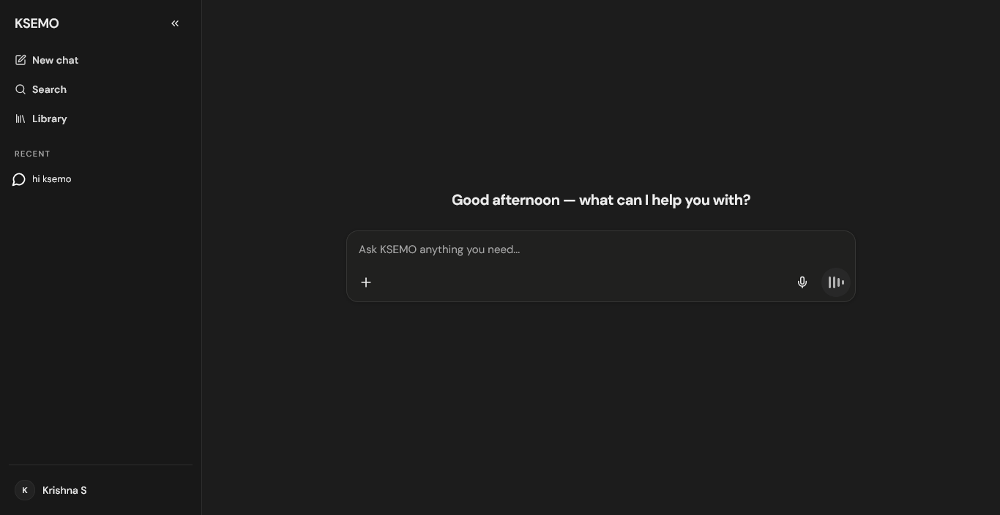

<p align="center">
  
</p>


<h1 align="center">KSEMO</h1>


<p align="center">
  An intelligent AI assistant platform with durable memory, document creation, and voice capabilities.
</p>


<p align="center">
  <a href="#overview">Overview</a> &nbsp;&middot;&nbsp;
  <a href="#key-features">Features</a> &nbsp;&middot;&nbsp;
  <a href="#how-it-works">How It Works</a> &nbsp;&middot;&nbsp;
  <a href="#installation">Installation</a> &nbsp;&middot;&nbsp;
  <a href="#usage">Usage</a> &nbsp;&middot;&nbsp;
  <a href="#license">License</a>
</p>


<br/>


## Overview


KSEMO is an AI-powered assistant platform built to bring chat, document creation, voice interaction, and personal knowledge management into one unified experience. From real-time conversations to professional document generation, everything happens inside a single application.


The platform connects to AI language models, streams responses in real time, and generates professional documents directly from conversation. It remembers user preferences and facts across sessions, supports voice conversations with speech-to-text and text-to-speech, and organizes work through a project-based workspace with a file library.


Whether you are drafting a report, brainstorming ideas, managing reference files, or simply having a conversation, KSEMO gives you a single interface that handles it all — with memory, context, and voice built in from the ground up.


<br/>


## Project Overview


KSEMO is designed around one core idea: working with an AI assistant should feel effortless, not scattered. The platform takes you from a single prompt to a complete result — whether that is a conversation, a document, or a voice interaction — in seconds.


The experience begins on the main chat interface, where you can type or speak your message, attach files, and watch the assistant respond in real time. From there, you can switch into document creation modes to generate PDFs, Word documents, Excel spreadsheets, PowerPoint presentations, or text files directly from your conversation.


When you are ready to go further, the platform offers a durable memory system that learns about you over time, a file library for storing and referencing documents, project organization for grouping related conversations, and message editing with full version history.


Beyond that, KSEMO includes a personal settings hub for managing your AI model, persona, and speech preferences, a full voice conversation mode with hands-free interaction, conversation sharing through public links and email, and support pages that answer your questions directly.


<br/>


## Key Features


**Real-Time AI Chat**


Type a message and receive a streaming response in real time. The assistant appears to write as it goes, with the ability to stop it mid-response. Every conversation is saved automatically with an intelligently generated title.


**Durable Memory**


KSEMO automatically extracts important facts from your conversations — your preferences, relationships, habits, and important details — and stores them across sessions. In future conversations, the assistant recalls what it knows about you so responses feel personal and continuous. The memory system is fully user-controlled and categorizes entries by sensitivity.


**Document Creation**


Select a format from the chat composer — PDF, Word, Excel, PowerPoint, or Text — and the assistant creates a complete, downloadable document from your conversation. Content is planned intelligently and produced with proper headings, tables, lists, and structured layouts.


**Voice Conversation**


Switch to voice mode for a hands-free conversational experience. Speak naturally and the assistant listens through your microphone, transcribes your speech, processes your request, and speaks the response back. You can interrupt mid-speech, and live subtitles display during playback.


**File Library**


Upload documents, spreadsheets, and presentations and the platform extracts their text content automatically. Browse your library in grid or list views, search by name, mark files as favorites, and attach any file to a conversation to give the assistant direct context from your documents.


**Message Editing and History**


Edit any of your own messages after sending them, and the assistant regenerates its response. Every edit is stored as a version, letting you browse an older version and restore it whenever you like.


**Conversation Management**


Pin, archive, rename, duplicate, export, or delete any conversation. Search across all your messages and conversation titles with a single shortcut. Group related conversations into projects for better organization.


**Sharing and Export**


Share any conversation through a public link that anyone can view in a read-only format, or send it directly by email. Export conversations as PDF or Word documents for offline use.


**Feedback System**


Rate any assistant response with a thumbs up or thumbs down. Your ratings are stored per message so the experience can be improved based on what you find useful.


**Settings and Preferences**


A comprehensive settings hub covers your account, security, appearance, keyboard shortcuts, data controls, memory settings, and feedback. Choose your AI model, select a persona, add custom instructions, and adjust the speech rate to your liking.


**Support Pages**


Browse a searchable FAQ with curated answers across topics, an assistant chatbot that answers from the FAQ, and complete Privacy Policy and Terms of Service documents.


<br/>


## How It Works


**1. Sign In and Authenticate**


Register with your email and password, or sign in through Google. You can also use the platform's own sign-in flow, recover your password by email, and reset it with a secure link. Sessions are managed securely with automatic sign-in detection.


**2. Start a Conversation**


Open the main chat interface and begin typing your message. The assistant responds in real time with streaming text. Your conversation is saved automatically, and a title is generated from your first exchange.


**3. Create Documents**


Open the plus menu in the composer and select a document format. Describe what you want — for example, "Create a weekly project report" — and the assistant generates a complete, downloadable file you can open in your favorite document applications.


**4. Upload and Reference Files**


Open the Library workspace to upload your documents. The platform extracts and reads their text automatically. Attach any file to a conversation and the assistant uses its content as context when responding to your messages.


**5. Talk with Voice**


Press the microphone button to record your voice and have it inserted as text, or enter full voice mode for a hands-free conversation. The assistant listens, processes, and speaks back — with the ability to interrupt at any time.


**6. Let Memory Learn**


Enable the memory system in Settings and the platform begins automatically extracting facts from your conversations. Over time it builds a profile of your preferences and context, and in future conversations relevant memories are silently brought into the assistant's context so responses feel personal.


**7. Organize with Projects**


Group your conversations into projects to keep related work together. Archive projects you are done with or delete them entirely. Files can sit in your library and be attached to any conversation at any time.


**8. Share and Export**


Toggle public sharing on any conversation to generate a shareable link, or send it by email. Export conversations as PDF or Word documents whenever you need a copy outside the platform.


<br/>


## Installation


**Prerequisites**


- Node.js
- pnpm
- A Supabase PostgreSQL database
- An API key for the AI language model
- Google OAuth credentials (optional, for Google Sign-In)
- SMTP email credentials (optional, for password reset and email sharing)
- A JWT secret for secure session signing


**Setup**


```bash
git clone https://github.com/your-username/KSEMO.git
cd KSEMO


pnpm install
```


**Environment Configuration**


Create a `.env` file in the project root:


```
JWT_SECRET=your-jwt-secret
SUPABASE_URL=your-supabase-url
SUPABASE_ANON_KEY=your-supabase-anon-key
SUPABASE_SERVICE_ROLE_KEY=your-supabase-service-role-key
LLM_BASE_URL=your-llm-base-url
GEMINI_API_KEY=your-llm-api-key
GOOGLE_CLIENT_ID=your-google-client-id
GOOGLE_CLIENT_SECRET=your-google-client-secret
GOOGLE_OAUTH_REDIRECT_URI=your-oauth-redirect-uri
SMTP_USER=your-smtp-user
SMTP_PASS=your-smtp-password
SMTP_FROM=your-smtp-sender
VITE_APP_ID=your-app-identifier
```


**Initialize the Database**


Apply the database schema in the `supabase-schema` folder to your Supabase project. The schema includes all tables, row-level security policies, search functions, and triggers.


**Start the Application**


```bash
pnpm dev
```


The application will be available at `http://localhost:3000`. When no database is configured, the platform runs on a built-in in-memory store with a demo account so you can try everything immediately.


<br/>


## Usage


Once the application is running, sign in to reach the main chat interface.


**Create an Account**


Register with your email and password or sign in with Google. This gives you access to the full platform — conversations, document generation, memory, file library, and the AI assistant.


**Start a Conversation**


Type a message and press Enter. The assistant responds in real time. Your conversation is saved automatically and titled for you.


**Generate Documents**


Open the plus menu in the composer and choose PDF, Word, Excel, PowerPoint, or Text. Describe what you need and download the generated file.


**Upload Files**


Open the Library workspace to upload documents and browse them in grid or list view. Attach any file to a conversation to give the assistant its content as context.


**Use the AI Assistant**


Hold the microphone to speak your message, or enter voice mode for a full hands-free conversation with the assistant. Subtitles display during responses.


**Manage Your Conversations**


Use the sidebar to pin, archive, rename, duplicate, export, or delete conversations. Search all your messages with the search shortcut, and revisit any older version of an edited message.


**Share Conversations**


Open the share dialog on any conversation to generate a public link or send it by email. Recipients can view the full conversation in a read-only format.


**Configure Settings**


Open Settings to manage your account, change your password, choose your AI model and persona, add custom instructions, adjust speech settings, switch themes, and review your stored memories. Use the Data tab to export or delete your account and all associated data.


<br/>


## License


MIT


<br/>


<div align="center">
  <sub>KSEMO</sub>
  <br/>
  <sub>&copy; 2026</sub>
</div>