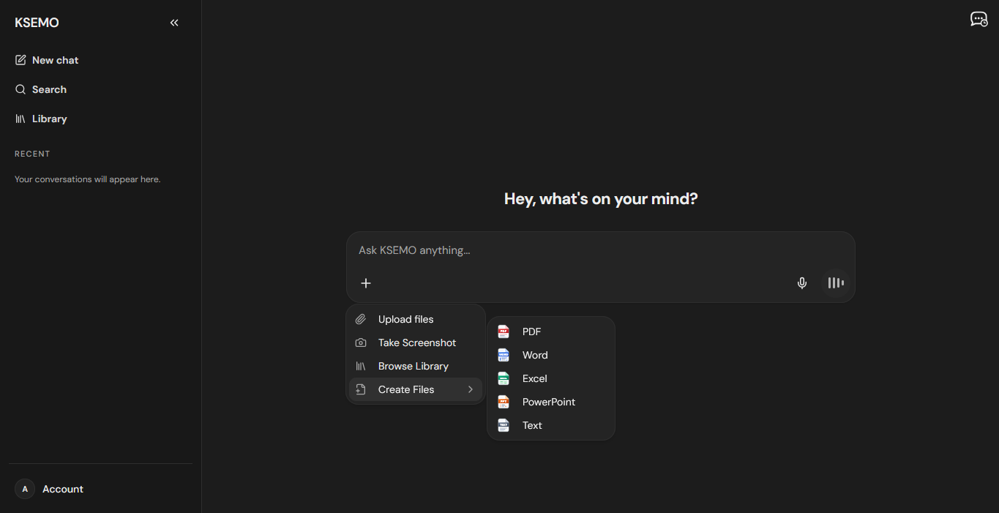
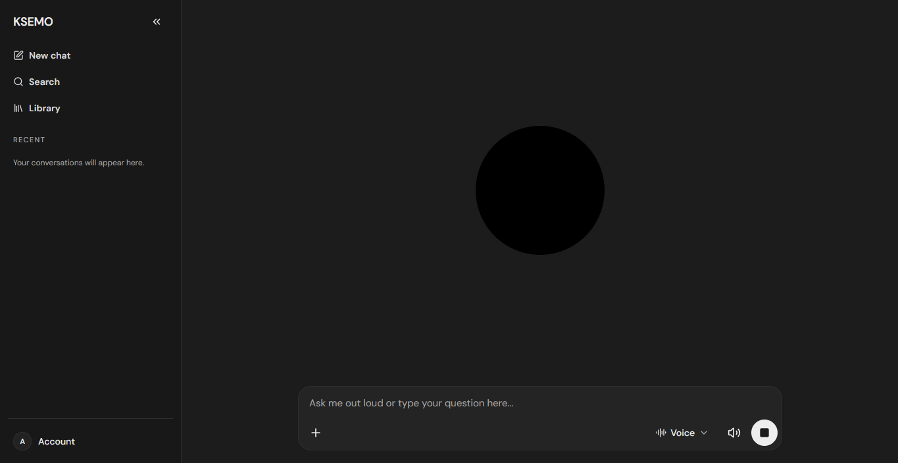
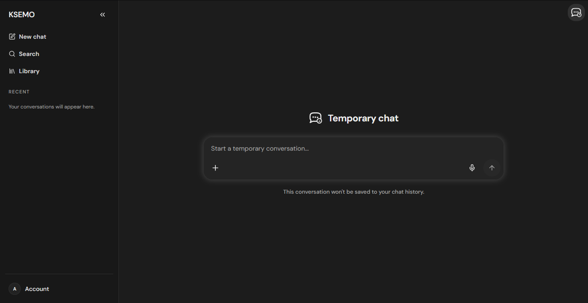
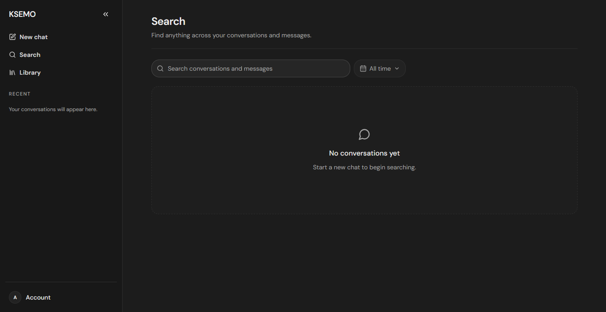
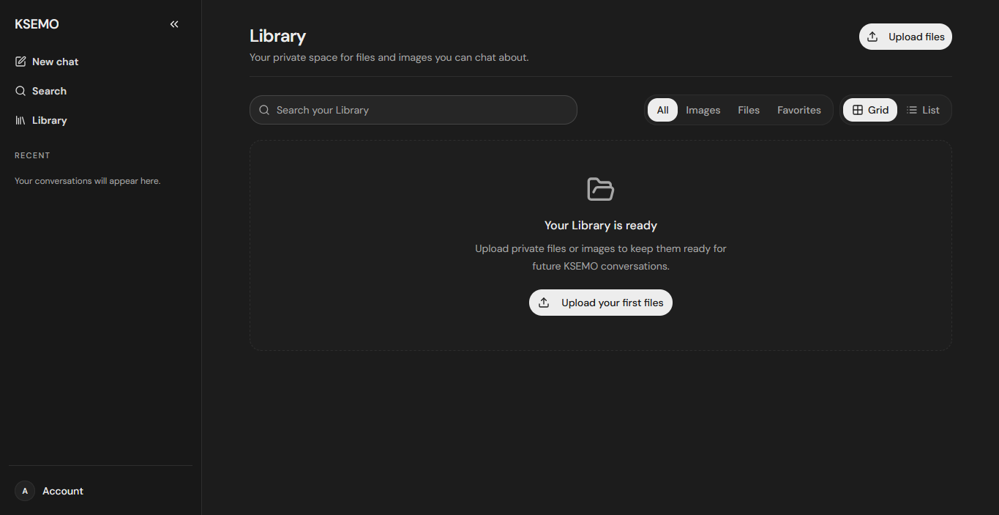
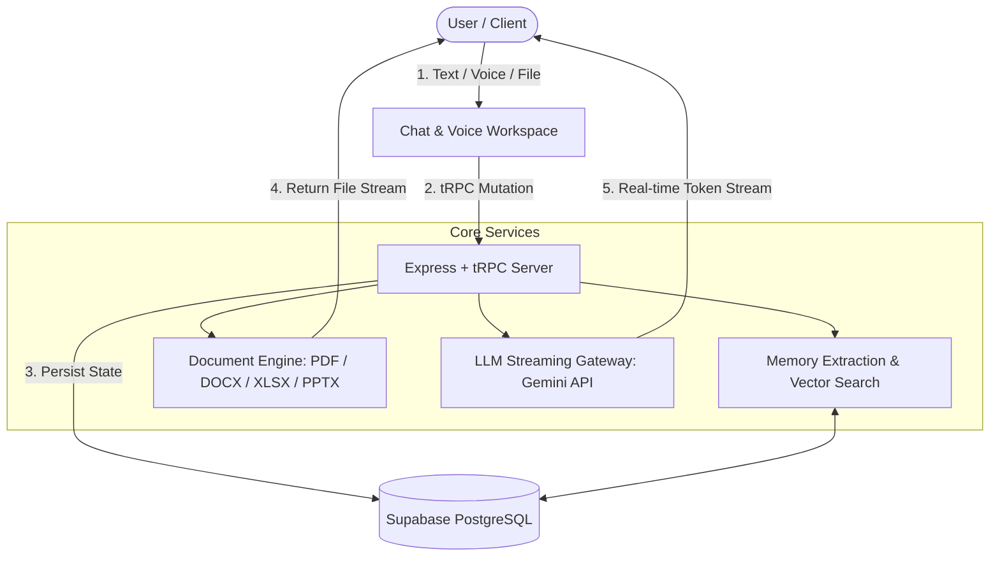

<p align="center">
  
</p>

<h1 align="center">KSEMO</h1>

<p align="center">
  <strong>Next-Generation AI Workspace with Durable Memory, Document Generation, Voice Intelligence & Knowledge Management</strong>
</p>

<p align="center">
  
  
  
  
  
  
  
</p>

<p align="center">
  <a href="#overview">Overview</a> &nbsp;&middot;&nbsp;
  <a href="#visual-interface-walkthrough--image-analysis">Visual Interface Analysis</a> &nbsp;&middot;&nbsp;
  <a href="#key-features">Key Features</a> &nbsp;&middot;&nbsp;
  <a href="#architecture--tech-stack">Architecture</a> &nbsp;&middot;&nbsp;
  <a href="#installation--setup">Installation</a> &nbsp;&middot;&nbsp;
  <a href="#environment-variables">Environment</a> &nbsp;&middot;&nbsp;
  <a href="#usage-guide">Usage Guide</a> &nbsp;&middot;&nbsp;
  <a href="#license">License</a>
</p>

---

## Overview

**KSEMO** is an all-in-one AI assistant and productivity platform built to unify conversational intelligence, multi-format document authoring, real-time voice streaming, and personal knowledge management into a seamless, distraction-free desktop-grade web application.

Unlike conventional chat interfaces that operate in silos, KSEMO integrates **durable cross-session memory**, **native document generation** (PDF, Word, Excel, PowerPoint, Text), **full-duplex voice interactions**, and a **centralized file library**. Whether you are brainstorming, drafting complex analytical reports, searching past conversations, or querying uploaded data files, KSEMO delivers a coherent, context-aware environment powered by modern LLMs.

---

## Visual Interface Walkthrough & Image Analysis

The application architecture and user journey are organized across five core interface states. Below is a detailed feature breakdown and UI/UX analysis of each screen in numerical order:

---

### 1. Core Chat Workspace & Multi-Format Document Generation

<p align="center">
  
</p>

#### 🔍 Analysis & Capabilities:
- **Central Conversational Hub**: Features a sleek dark-themed workspace with a distraction-free conversational canvas and responsive prompt input box (*"Ask KSEMO anything..."*).
- **Multimodal Composer & Action Menu**:
  - **Upload Files**: Direct attachment of documents, raw text, and images for real-time document Q&A.
  - **Take Screenshot**: Integrated screen capture tool to seamlessly paste visual snapshots into the prompt.
  - **Browse Library**: Rapid access to previously uploaded and processed documents stored in your private library.
  - **Create Files (Submenu)**: Direct on-the-fly document compilation into **PDF**, **Microsoft Word (`.docx`)**, **Microsoft Excel (`.xlsx`)**, **Microsoft PowerPoint (`.pptx`)**, and **Plain Text (`.txt`)**.
- **Sidebar & Quick Navigation**: Accessible sidebar navigation for *New Chat*, global *Search*, *Library*, *Recent Sessions*, and profile/account settings.

---

### 2. Interactive Hands-Free Voice Assistant & Live Audio Mode

<p align="center">
  
</p>

#### 🔍 Analysis & Capabilities:
- **Immersive Voice Interaction**: Dedicated voice interface with a centered pulsating audio visualizer that provides real-time visual feedback for listening and speaking states.
- **Bi-Directional Speech Streaming**:
  - Continuous speech-to-text (STT) captures natural speech with instant transcription.
  - Natural text-to-speech (TTS) synthesis delivers low-latency spoken responses.
- **Real-Time Voice Controls**:
  - Voice selector dropdown (e.g., custom persona tone and speed adjustment).
  - Speaker output toggle and master stop/interrupt button to pause audio playback instantly.
  - Fallback hybrid input allowing users to speak out loud or type questions interchangeably.

---

### 3. Ephemeral & Privacy-Preserving Temporary Chat

<p align="center">
  
</p>

#### 🔍 Analysis & Capabilities:
- **Zero Data Retention**: A dedicated incognito mode designed for disposable inquiries, sensitive data processing, and quick brainstorming.
- **Visual Privacy Feedback**: Distinctive top notification and glowing input badge (*"Temporary chat — This conversation won't be saved to your chat history"*).
- **Ephemeral State Lifecycle**:
  - Conversations exist exclusively in client memory for the duration of the session.
  - No database logging, no analytics tracking, and excluded from long-term memory extraction.

---

### 4. Global Full-Text Search & Context Retrieval Engine

<p align="center">
  
</p>

#### 🔍 Analysis & Capabilities:
- **Deep Historical Search**: Instant indexing and querying across all past conversation titles, user prompts, assistant answers, and attached notes.
- **Time-Range Filters**: Dropdown filtering system (*"All time"*, today, past week, past month) to quickly narrow down relevant insights.
- **Quick Jump & Preview**: Clean search result cards enabling instant message navigation and one-click session resumption.

---

### 5. Centralized Knowledge Base & Private File Library

<p align="center">
  
</p>

#### 🔍 Analysis & Capabilities:
- **Private Asset Vault**: A secure hub for storing, organizing, and referencing documents, spreadsheets, slides, and images across conversations.
- **Automated Text & Data Extraction**: Uploaded files (PDFs, Word docs, Excel sheets) are automatically parsed and indexed for context injection.
- **Advanced Asset Organization**:
  - **Categorical Filters**: Filter by *All*, *Images*, *Files*, or *Favorites*.
  - **View Layout Switching**: Toggle between responsive **Grid View** and detailed **List View**.
  - **Direct Search**: In-library instant keyword search to locate specific uploaded assets in seconds.

---

## Key Features

### 🧠 Durable Cross-Session Memory
- Automatically identifies and retains key user facts, preferences, project requirements, and personal contexts.
- Contextually injects relevant memories into future prompts without manual re-prompting.
- Full user control to view, edit, sensitive-tag, or delete stored memories.

### 📄 Native Document Creation Engine
- **PDF Generation**: High-fidelity structured PDF rendering via `pdf-lib` and `unpdf`.
- **Word (`.docx`)**: Formatted document compilation with headings, bullet points, and styled callouts using `docx`.
- **Excel (`.xlsx`)**: Structured multi-column analytical spreadsheets powered by `xlsx`.
- **PowerPoint (`.pptx`)**: Polished presentation decks with slides and title layouts via `pptxgenjs`.

### 🎙️ Full-Duplex Voice & Audio Processing
- Hands-free live conversation with customizable speech rates and natural TTS synthesis.
- Audio activity visualization with immediate mid-sentence interruption handling.
- Live subtitle rendering during voice playback.

### 🔄 Message Branching & Version History
- Edit previous prompts to regenerate alternative reasoning paths.
- Linear version history lets you switch between past iterations without losing data.

### 🌐 Secure Sharing & Collaboration
- Generate public, read-only shareable links with cryptographic tokens.
- Export transcripts directly to PDF or Word documents for offline sharing.
- Built-in email sharing integration via SMTP.

---

## Architecture & Tech Stack

```
KSEMO/
├── client/                 # React 19 Single Page Application
│   ├── src/
│   │   ├── components/     # UI components (Radix UI, Tailwind CSS, Lucide Icons)
│   │   ├── hooks/          # Audio recording, streaming, theme, and query hooks
│   │   ├── pages/          # Chat, Library, Search, Settings, Auth, and Support pages
│   │   ├── lib/            # tRPC client, Supabase client, utility helpers
│   │   └── img/            # Platform screenshot assets and brand graphics
├── server/                 # Express & tRPC Node.js Backend
│   ├── _core/              # Server entry point, context, and middleware
│   ├── routers/            # tRPC routers (chat, memory, library, documents, voice, auth)
│   ├── services/           # LLM connector, document builders, OCR/text parsers, mailer
│   └── storage/            # In-memory database fallback & file management
├── shared/                 # Shared TypeScript schemas, types, and Zod validators
└── supabase-schema/        # PostgreSQL migrations, triggers, RLS policies, and search functions
```

### Technology Highlights:
- **Frontend**: React 19, TypeScript, Tailwind CSS v4, Radix UI Primitives, Framer Motion, TanStack Query.
- **Backend & API**: Node.js, Express, tRPC v11, Zod schema validation, Jose (JWT authentication).
- **Database & Storage**: Supabase (PostgreSQL with Row Level Security & full-text search) + in-memory development store fallback.
- **Document Engines**: `docx`, `pdf-lib`, `xlsx`, `pptxgenjs`, `mammoth`, `unpdf`.
- **AI / LLM Integration**: Gemini API & OpenAI-compatible streaming endpoints.

---

## System Data Flow



---

## Installation & Setup

### Prerequisites
- **Node.js**: `v20.x` or higher
- **pnpm**: `v10.x` or higher
- **Supabase Account**: (Optional for cloud database; in-memory demo mode runs automatically if unset)
- **AI API Key**: Gemini API key or compatible LLM provider key

### 1. Clone & Install Dependencies
```bash
git clone https://github.com/your-username/KSEMO.git
cd KSEMO

pnpm install
```

### 2. Configure Environment Variables
Create a `.env` file in the project root:

```env
# Server & Authentication
PORT=3000
JWT_SECRET=your-secure-jwt-secret-key-min-32-chars

# Supabase Database (Optional for Production)
SUPABASE_URL=https://your-project.supabase.co
SUPABASE_ANON_KEY=your-supabase-anon-key
SUPABASE_SERVICE_ROLE_KEY=your-supabase-service-role-key

# AI / LLM Configuration
LLM_BASE_URL=https://generativelanguage.googleapis.com
GEMINI_API_KEY=your-gemini-api-key

# Google OAuth (Optional)
GOOGLE_CLIENT_ID=your-google-client-id
GOOGLE_CLIENT_SECRET=your-google-client-secret
GOOGLE_OAUTH_REDIRECT_URI=http://localhost:3000/api/auth/google/callback

# SMTP Email Service (Optional for sharing & password reset)
SMTP_USER=your-smtp-username
SMTP_PASS=your-smtp-password
SMTP_FROM=noreply@ksemo.ai
```

### 3. Initialize Database Schema (Supabase)
Execute the SQL migrations found in the `supabase-schema/` directory within the Supabase SQL editor to set up tables, triggers, and Row Level Security (RLS) policies.

### 4. Run Development Server
```bash
pnpm dev
```
Open [http://localhost:3000](http://localhost:3000) in your browser.

---

## Usage Guide

| Action | Steps |
| :--- | :--- |
| **Start Chatting** | Type any query into the central prompt box or click the microphone to dictate. |
| **Create Documents** | Click the `+` button in the composer &rarr; select **Create Files** &rarr; choose PDF, Word, Excel, PowerPoint, or Text. |
| **Hands-Free Voice** | Click the audio visualizer icon in the chat composer to open Voice Mode with real-time speech synthesis. |
| **Temporary Incognito Mode** | Toggle temporary chat mode to conduct private, unlogged conversational sessions. |
| **Manage File Library** | Navigate to `Library` from the sidebar to upload documents, preview assets, and organize favorites. |
| **Full-Text Search** | Navigate to `Search` to query conversation history and message logs by keyword and date filters. |
| **Share Conversation** | Open conversation settings &rarr; generate a public link or send directly via email. |

---

## NPM Scripts

```bash
pnpm dev      # Start development server with hot reload
pnpm build    # Build production client (Vite) and bundle backend (esbuild)
pnpm start    # Run production build from dist/index.js
pnpm check    # Run TypeScript static type checking
pnpm format   # Format entire codebase with Prettier
pnpm test     # Run test suite with Vitest
```

---

## License

This project is licensed under the **MIT License** — see the [LICENSE](LICENSE) file for details.

<br/>

<div align="center">
  <sub>Designed & Developed for <strong>KSEMO</strong></sub>
  <br/>
  <sub>&copy; 2026 KSEMO Platform. All rights reserved.</sub>
</div>